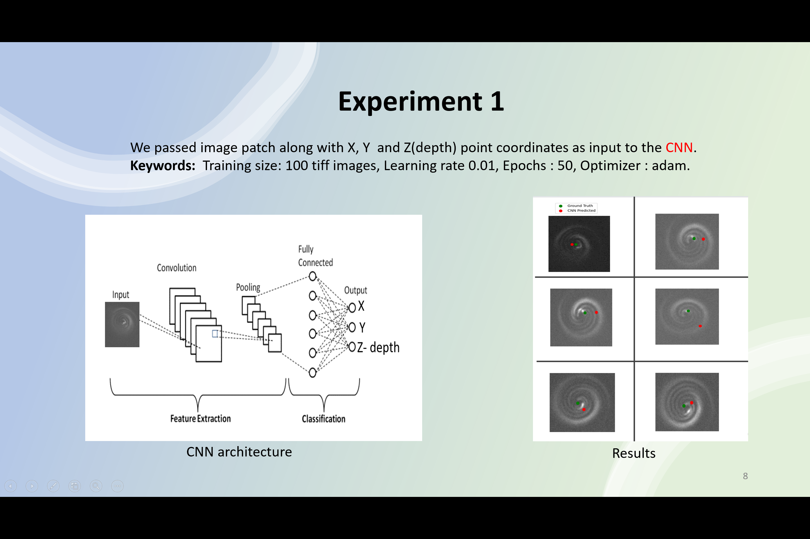
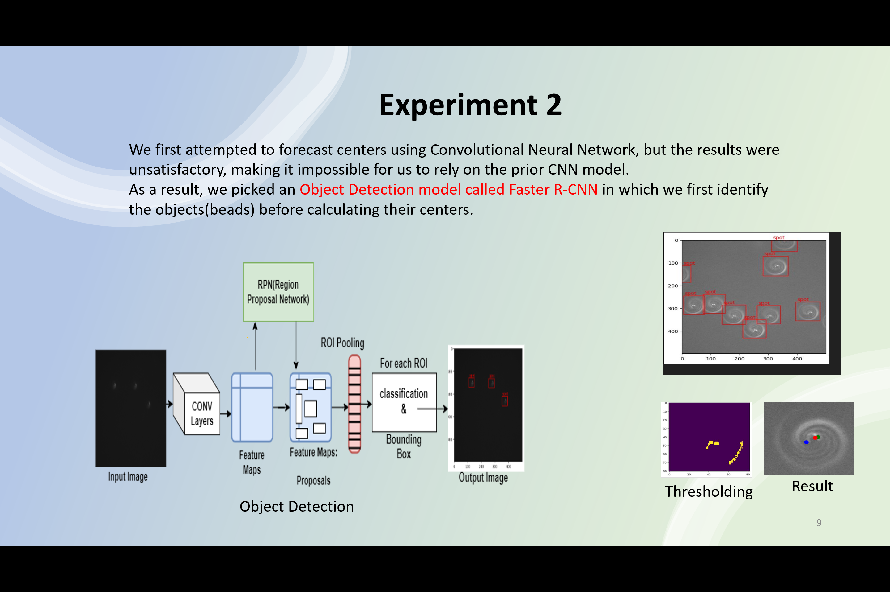
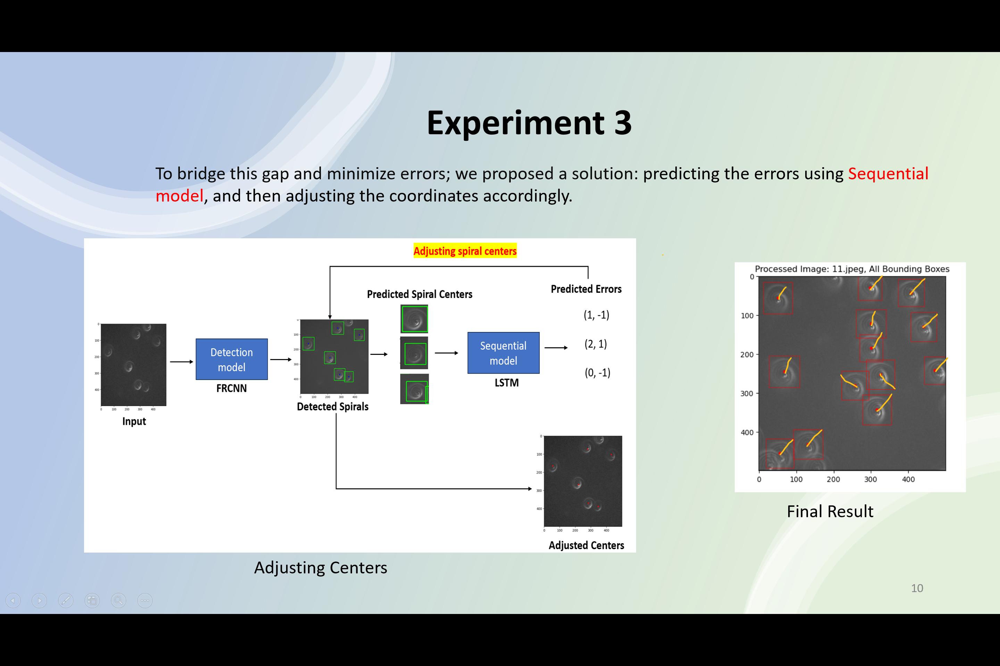

Code can be shared based  on request: annemsony.137@gmail.com
# Chromatin Imaging and Analysis in Cancer Cells

## Overview
This repository contains the code and resources for a project focused on identifying and analyzing chromatin positions in cancer cells using deep learning techniques. The goal of the project is to utilize advanced image processing and machine learning models to accurately detect chromatin within cell images, ultimately enhancing cancer research and diagnosis. The project leverages techniques such as 3D Convolutional Neural Networks (CNNs), object detection models, synthetic data generation, and error prediction models.

## Project Highlights
- **Data Preprocessing**: 500 TIFF images of chromatin in cancer cells were labeled and enhanced using techniques like histogram equalization and denoising.
- **Model Development**: Implemented and evaluated several deep learning models, including:
  - 3D Convolutional Neural Networks (CNNs)
  - Fast R-CNN, Faster R-CNN, and YOLOv8 for chromatin localization and detection
  - - 
- **Model Conversion**: Exported the trained models from PyTorch to ONNX format for broader deployment and interoperability.
- **Synthetic Data Generation**: Used the Stable Diffusion model to generate synthetic chromatin images, augmenting the dataset for training.
- - 
- **Error Prediction**: Developed a Time Distributed CNN with Bi-directional LSTM to predict and correct detection errors, improving model reliability.
- **Performance**: Achieved an inference score of 82%, demonstrating the effectiveness of the models in detecting chromatin features in cancer cell images.

-  

